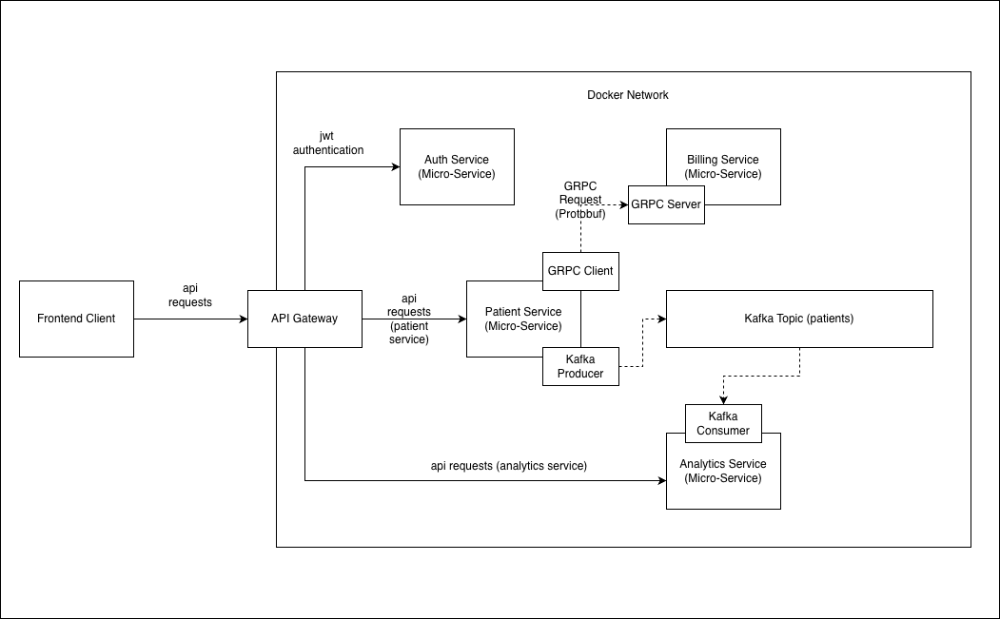
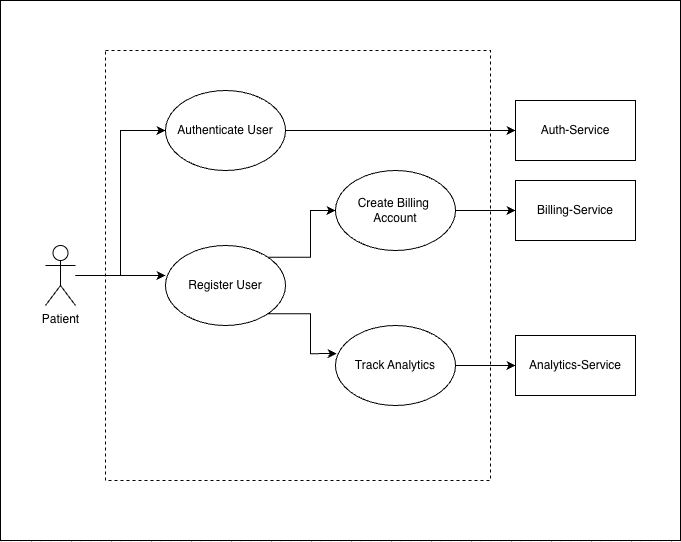
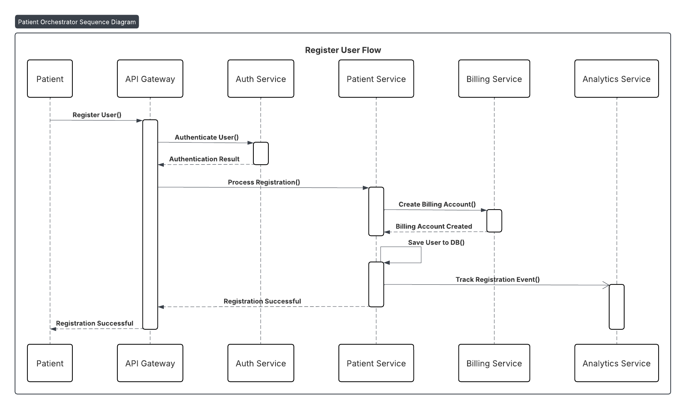
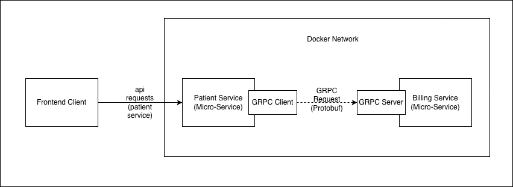
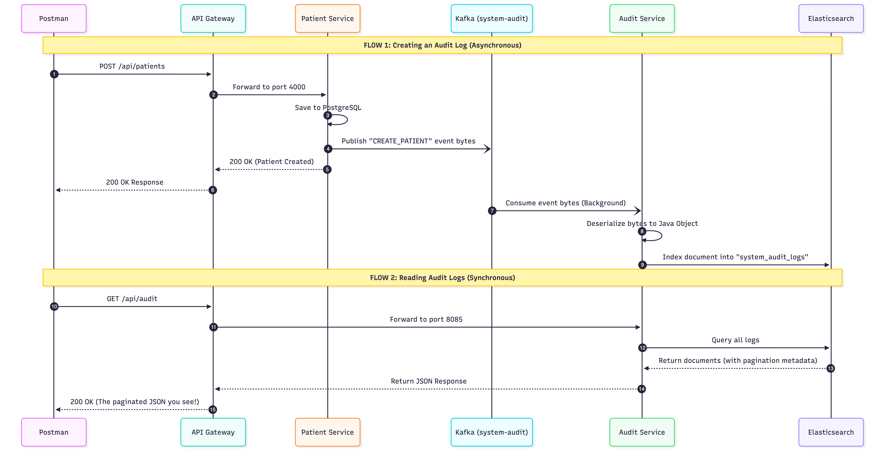
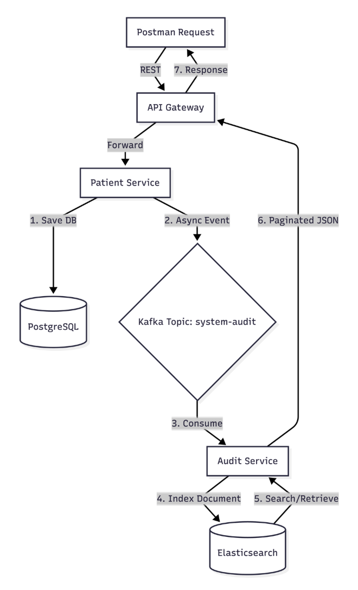

# Patient Data Orchestrator

An enterprise-grade, event-driven microservices architecture built with Spring Boot, Kafka, gRPC, and Elasticsearch.

This system orchestrates patient registration, billing account creation, analytics tracking, and strict compliance auditing. It demonstrates modern backend patterns including asynchronous event sourcing, synchronous high-performance RPC, and centralized API routing.

##  The Significance & Architecture
This project is designed to solve real-world healthcare tech challenges:
* **High Availability & Decoupling:** Heavy operations (Analytics, Auditing) are offloaded to **Apache Kafka**, ensuring the main Patient Service remains blazing fast and non-blocking.
* **High-Performance Internal APIs:** Synchronous communication (like triggering Billing creation) uses **gRPC / Protobufs**, which is exponentially faster and smaller over the network than traditional REST JSON.
* **Strict Compliance Logging:** A dedicated Audit Service consumes Kafka events and indexes them into **Elasticsearch**, providing a paginated, hyper-fast, immutable trail of every read/write action taken in the system.

---

## System Visualizations

### 1. High-Level Architecture
The system consists of 6 distinct microservices hidden behind a Spring Cloud API Gateway. Traffic is authenticated via JWTs, and services communicate through a mix of REST, gRPC, and Kafka event streams.


### 2. Core Use Cases
The primary actor (Hospital Staff / Admin) interacts with the system to onboard new patients. This single administrative action triggers a cascade of distributed operations across the Auth, Billing, and Analytics services to fully provision the patient's profile.


### 3. Patient Onboarding Sequence
When an Admin registers a new patient, the API Gateway authenticates the Admin's JWT. The Patient Service updates PostgreSQL, synchronously calls the Billing Service via gRPC to open a financial account, and asynchronously fires an onboarding event to the Analytics Service via Kafka.


### 4. gRPC Communication Model
To ensure maximum speed and strongly-typed contracts between internal microservices, the Patient Service acts as a gRPC Client, sending Protobuf payloads directly to the Billing Service gRPC Server.


### 5. Audit & Compliance Event Sourcing
Every CRUD operation in the Patient Service fires an asynchronous byte-array payload to the `system-audit` Kafka topic. The Audit Service consumes this, deserializes the Protobuf, and indexes it into Elasticsearch. Clients can then synchronously fetch paginated logs via the Gateway.


### 6. Audit Flowchart
A logical breakdown of the compliance flow, showing the split between standard database saving and background Elasticsearch indexing.



---

##  Tech Stack
* **Core:** Java 21, Spring Boot 3.x, Spring Cloud Gateway
* **Databases:** PostgreSQL (Relational), Elasticsearch (NoSQL/Search)
* **Message Broker:** Apache Kafka (Zookeeper/KRaft)
* **RPC Framework:** gRPC & Protocol Buffers (Protobuf)
* **Security:** JWT (JSON Web Tokens)
* **Infrastructure:** Docker & Docker Compose
* **Monitoring:** Kibana

---

##  Microservices Breakdown
1. **`apigateway-service` (Port 4004):** The single entry point. Handles routing and JWT validation (StripPrefix & Filters).
2. **`auth-service` (Port 4005):** Manages user credentials, issues JWTs, and stores data in its own isolated Postgres DB.
3. **`patient-service` (Port 4000):** The core domain. Handles CRUD operations, extracts JWT context, saves to Postgres, acts as a Kafka Producer, and a gRPC Client.
4. **`billing-service` (Port 4001/9090):** gRPC server that creates financial profiles upon patient registration.
5. **`analytics-service` (Port 4002):** Kafka consumer that tracks registration metrics.
6. **`audit-service` (Port 8085):** Kafka consumer and Elasticsearch client. Provides a paginated REST API for compliance logs.

---

##  Running the Project

The entire architecture is containerized. You do not need to install Kafka, Postgres, or Elasticsearch on your local machine.

**1. Clone the repository**
```bash
git clone [https://github.com/yourusername/Patient-Data-Orchestrator.git](https://github.com/yourusername/Patient-Data-Orchestrator.git)
cd Patient-Data-Orchestrator