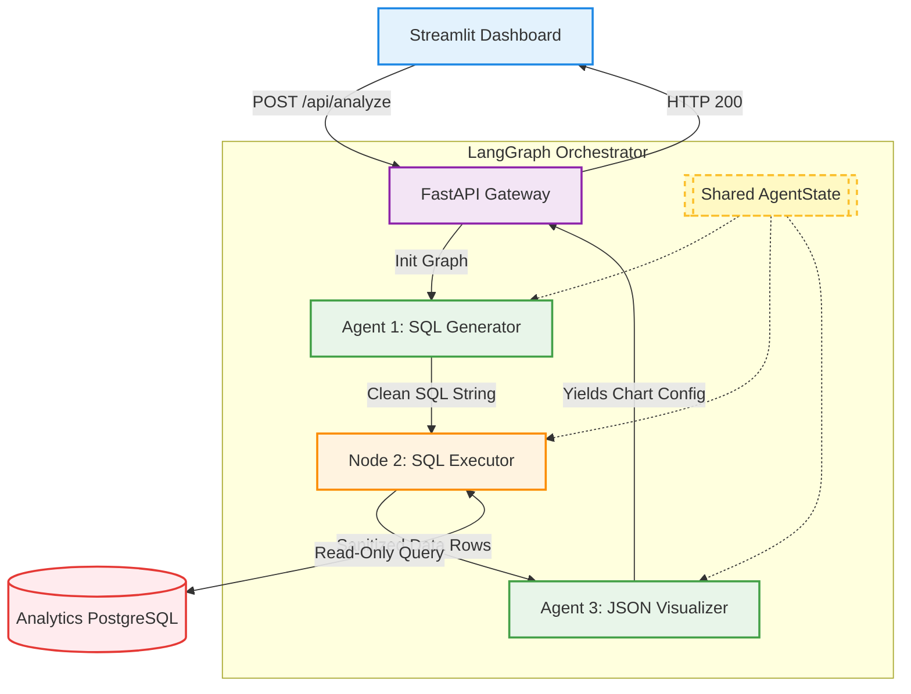
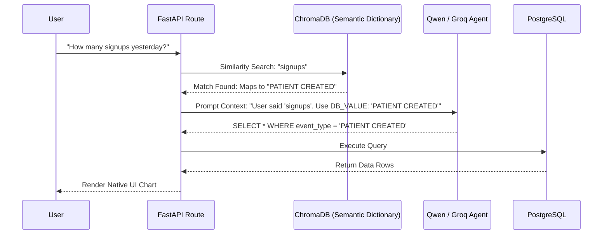
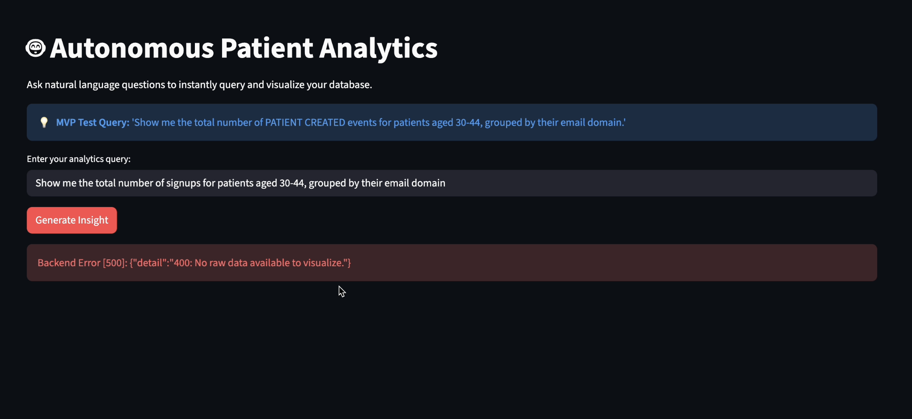
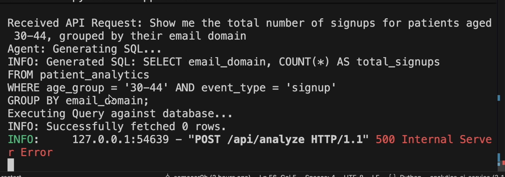
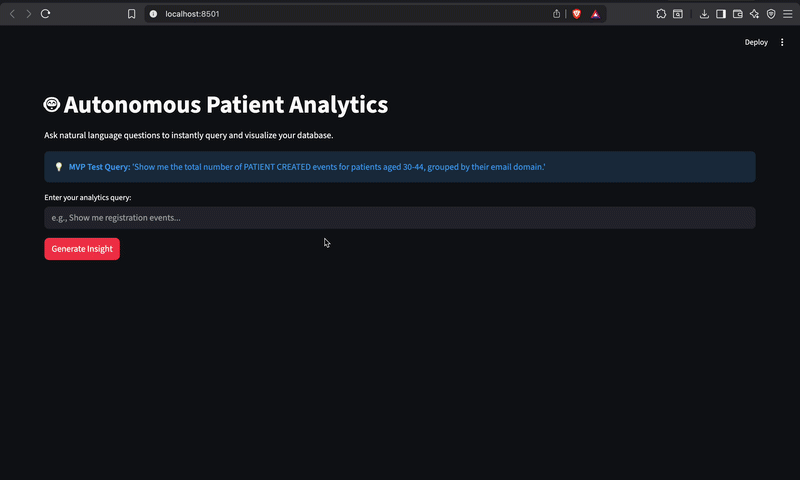

# Patient Data Orchestrator

An enterprise-grade, event-driven microservices architecture built with Spring Boot, Kafka, gRPC, Elasticsearch, and a stateful Multi-Agent AI Analytics Engine.

This system orchestrates patient registration, billing account creation, analytics tracking, and strict compliance auditing. It demonstrates modern backend patterns including asynchronous event sourcing, synchronous high-performance RPC, centralized API routing, and autonomous AI data extraction.

## The Significance & Architecture

This project is designed to solve real-world healthcare tech challenges:

* **High Availability & Decoupling:** Heavy operations (Analytics, Auditing) are offloaded to **Apache Kafka**, ensuring the main Patient Service remains blazing fast and non-blocking.
* **High-Performance Internal APIs:** Synchronous communication (like triggering Billing creation) uses **gRPC / Protobufs**, which is exponentially faster and smaller over the network than traditional REST JSON.
* **Strict Compliance Logging:** A dedicated Audit Service consumes Kafka events and indexes them into **Elasticsearch**, providing a paginated, hyper-fast, immutable trail of every read/write action taken in the system.
* **Agentic AI Analytics:** A Python-based **LangGraph** microservice acts as a highly secure, deterministic bridge between natural human language and raw PostgreSQL data, utilizing Semantic Vector Search to translate human slang into strict database constants.

---

## System Visualizations

### 1. High-Level Architecture

The system consists of 7 distinct microservices hidden behind a Spring Cloud API Gateway and a FastAPI backend. Traffic is authenticated via JWTs, and services communicate through a mix of REST, gRPC, and Kafka event streams.


### 2. Core Use Cases

The primary actor (Hospital Staff / Admin) interacts with the system to onboard new patients. This single administrative action triggers a cascade of distributed operations across the Auth, Billing, and Analytics services to fully provision the patient's profile.


### 3. Patient Onboarding Sequence

When an Admin registers a new patient, the API Gateway authenticates the Admin's JWT. The Patient Service updates PostgreSQL, synchronously calls the Billing Service via gRPC to open a financial account, and asynchronously fires an onboarding event to the Analytics Service via Kafka.


### 4. gRPC Communication Model

To ensure maximum speed and strongly-typed contracts between internal microservices, the Patient Service acts as a gRPC Client, sending Protobuf payloads directly to the Billing Service gRPC Server.


### 5. Audit & Compliance Event Sourcing

Every CRUD operation in the Patient Service fires an asynchronous byte-array payload to the `system-audit` Kafka topic. The Audit Service consumes this, deserializes the Protobuf, and indexes it into Elasticsearch. Clients can then synchronously fetch paginated logs via the Gateway.


### 6. Audit Flowchart

A logical breakdown of the compliance flow, showing the split between standard database saving and background Elasticsearch indexing.


---

## Autonomous AI Analytics Engine

To allow non-technical hospital administrators to query complex relational data, the architecture includes a decoupled Python microservice. This is not a standard "RAG" wrapper; it is a **Stateful Multi-Agent Workflow** built with LangGraph, completely isolating non-deterministic AI generation from deterministic database execution.

### The AI Pipeline Architecture

This diagram illustrates the bounded contexts of the AI system. The LLM never touches the database directly. It writes a SQL string, which is executed safely by a deterministic Python node using a read-only role (`ai_reader`).



### Engineering the Semantic Data Dictionary (Vector DB)

**The Flaw of Standard LLM Analytics:**
LLMs are rigid translators. When a user asks for *"total new signups"*, the LLM attempts to query `WHERE event_type = 'signups'`. Because PostgreSQL requires exact string matches, and the database stores this event as `PATIENT CREATED`, the pipeline crashes, returning zero rows.

**The Enterprise Fix:**
We implemented a Semantic Routing Layer using **ChromaDB** and **HuggingFace Sentence Transformers**. By embedding our database's official categorical variables alongside common human synonyms, we intercept the user's query *before* the LLM sees it.



### Before & After Vector DB Implementation

#### BEFORE: The Semantic Fracture

Without the Vector DB, the LLM translates the prompt verbatim. The database finds zero rows matching the slang "signups", and the visualizer agent crashes due to a lack of data.

**UI State — Crashed Visualizer:**



**Console Logs — Zero Rows Returned:**



#### AFTER: Semantic Rerouting (System Demo)

With ChromaDB intercepting the prompt, the system mathematically maps the human slang to the rigid database constants, injecting the correct filtering logic into the agent's state memory. The pipeline successfully executes and renders the interactive Plotly widget.

**Live Demo — End-to-End Semantic Rerouting:**

---

## Tech Stack

* **Core Backend:** Java 21, Spring Boot 3.x, Spring Cloud Gateway
* **AI & Agentic Flow:** Python 3.12, LangGraph, FastAPI, Streamlit, SQLAlchemy
* **Machine Learning:** HuggingFace (`all-MiniLM-L6-v2`), ChromaDB, Groq LLM API (Qwen/Llama)
* **Databases:** PostgreSQL (Relational), Elasticsearch (NoSQL/Search), Chroma (Vector)
* **Message Broker:** Apache Kafka (Zookeeper/KRaft)
* **RPC Framework:** gRPC & Protocol Buffers (Protobuf)
* **Security:** JWT (JSON Web Tokens)
* **Infrastructure:** Docker & Docker Compose
* **Monitoring:** Kibana

---

## Microservices Breakdown

1. **`apigateway-service` (Port 4004):** The single entry point. Handles routing and JWT validation (StripPrefix & Filters).
2. **`auth-service` (Port 4005):** Manages user credentials, issues JWTs, and stores data in its own isolated Postgres DB.
3. **`patient-service` (Port 4000):** The core domain. Handles CRUD operations, extracts JWT context, saves to Postgres, acts as a Kafka Producer, and a gRPC Client.
4. **`billing-service` (Port 4001/9090):** gRPC server that creates financial profiles upon patient registration.
5. **`analytics-service` (Port 4002):** Kafka consumer that tracks registration metrics.
6. **`audit-service` (Port 8085):** Kafka consumer and Elasticsearch client. Provides a paginated REST API for compliance logs.
7. **`analytics-ai-service` (Port 8000):** FastAPI LangGraph backend running the autonomous text-to-SQL architecture.
8. **`analytics-ui` (Port 8501):** Streamlit frontend dashboard for natural language queries and dynamic Plotly visualization.

---

## Automated Integration Testing

The architecture is backed by a formal **Grey-Box Integration Testing** framework

Grey-box testing was chosen deliberately: tests send external HTTP requests like a black-box client, while simultaneously asserting internal state changes across PostgreSQL, Elasticsearch, and gRPC — the white-box layer. This validates not just API responses, but the entire distributed choreography.

### Test Suite Results

| Test Class | Tests | Result | Time |
|---|---|---|---|
| AuthIntegrationTest | 2 | PASSED | 3.975s |
| PatientIntegrationTest | 2 | PASSED | 9.962s |
| PatientSecurityAndValidationTest | 3 | PASSED | 2.747s |
| AuditSideEffectTest | 1 | PASSED | 3.347s |
| BillingSideEffectTest | 1 | PASSED | 2.940s |

**9/9 tests passed. Exit code 0.**

### What Was Tested

**TS1 — Authentication & Security**
- Valid login returns HTTP 200 with a non-null JWT
- Invalid credentials return HTTP 401
- Requests with malformed/fake Bearer tokens are rejected at the Gateway

**TS2 — Patient Lifecycle & Validation**
- Full Create → Update → Delete lifecycle returns correct status codes at each step
- Missing required fields (email) return HTTP 400
- Duplicate email registration returns HTTP 400 with descriptive error

**TS3 — Distributed Side-Effects (the hard part)**
- Patient creation triggers an async Kafka event; `Awaitility` polls the Audit endpoint for 5 seconds to confirm the log appears in Elasticsearch with the correct `action: CREATE PATIENT`
- Patient creation triggers a synchronous gRPC call to the Billing Service; the test extracts the returned UUID and asserts the Billing account is `ACTIVE` with a zero initial balance

### Defects Found & Resolved

| Defect | Severity | Resolution |
|---|---|---|
| Audit Service crashed on startup — connected to Elasticsearch before the container was healthy | High | Docker Healthchecks + `depends_on: condition: service_healthy` in docker-compose.yml |
| Async race condition — test queried Elasticsearch before Kafka had delivered the message | Medium | Awaitility with a 5-second configurable polling timeout |
| Type mismatch — test passed an email string to an endpoint expecting a UUID | Medium | Refactored test to extract UUID from Patient creation response body |
| 401 failures — expired token across test classes | Low | Centralized `BaseIntegrationTest` with `@BeforeAll` token generation |

### Tools

`JUnit 5` `Rest-Assured` `Awaitility` `Docker-Compose` `Maven Surefire`

## Running the Project

The entire architecture is containerized. You do not need to install Kafka, Postgres, or Elasticsearch on your local machine.

**Clone the repository**

```bash
git clone https://github.com/yourusername/Patient-Data-Orchestrator.git
cd Patient-Data-Orchestrator
```

### Step 1: Boot the Java & Core Data Infrastructure

Run this from the root `Patient-Data-Orchestrator` folder to spin up the core platform in the background:

```bash
docker-compose up -d

```

(Give this about 30 to 45 seconds to let Elasticsearch and Kafka finish their internal health checks so your services can connect cleanly ).

### Step 2: Launch the AI Analytics Microservice

Open a second terminal window, navigate into your `analytics-ai-service` directory, and start the LangGraph backend:

```bash
cd analytics-ai-service
python -m app.main

```

*(This opens up the REST gateway on `http://127.0.0.1:8000` so it can communicate with the data layers).*

### Step 3: Launch the UI Dashboard

Open a third terminal window, stay in the `analytics-ai-service` directory, and boot your frontend presentation layer:

```bash
uv run streamlit run ui/app.py

```